CS at the University of Washington ('29). I like working close to the hardware: kernels, GPUs, emulators, and robots.

[advaithvecham.fly.dev](https://advaithvecham.fly.dev) · [LinkedIn](https://www.linkedin.com/in/advaithvecham/) · [advaiv2@cs.washington.edu](mailto:advaiv2@cs.washington.edu)

### now

- **Linux kernel, Rust for Linux** ([fork](https://github.com/adsdemaybe/linux/tree/rust-next) · [regulator.rs](https://github.com/torvalds/linux/blob/master/rust/kernel/regulator.rs) · [rust-for-linux list](https://lore.kernel.org/rust-for-linux/)). I'm adding safe `Regulator` methods for current limit, mode, and load on top of the C `regulator_*` API. The patches go through LKML review.

### projects

- [**SemiLLM**](https://github.com/adsdemaybe/FloatyLLM) ([site](https://adsdemaybe.github.io/FloatyLLM/)). Runs LLMs that don't fit in VRAM by streaming quantized layers from CPU to GPU. Each layer's precision is picked on the fly. C++ / CUDA
- [**weight-switching CoT**](https://github.com/adsdemaybe/weight_switching_CoT). When a model switches language mid chain-of-thought, it hot-swaps in a LoRA expert for that language while keeping one shared KV cache. PyTorch
- [**chip-8 / superchip emulator**](https://github.com/adsdemaybe/chip8_emulator). A cycle-accurate emulator with a CLI debugger. It passes the Corax+ test ROM. Rust
- [**Simbiote**](https://github.com/gaganshivakumara/simbiote) ([event](https://builderbase.com/event/dell-x-nvidia-ai-hackathon-seattle) · [post](https://www.linkedin.com/posts/gaganshivakumara_we-got-1st-place-at-the-dell-nvidia-ai-activity-7487624027109470208-yEto)). Takes an iPhone LiDAR scan to an OpenUSD sim, trains a robot there with RL, then lets you teleoperate it. Runs fully offline. **1st place, Dell x NVIDIA Hackathon Seattle**
- [**STRUCT**](https://github.com/adsdemaybe/nvidia-spark-hacks) ([event](https://luma.com/spark-hack-seattle)). Goes from a text prompt to a robot: CAD, PCB, teleop data, and RL, all driven by a 3-bit local model on one DGX Spark. **2nd, NVIDIA Dev Champions @ Spark Hack Seattle**
- **Insuo** (private). A plan-first browser agent with self-healing retries, packaged as a Tauri desktop app. I pitched it at YC Startup School.

### awards

- [YC Startup School 2026](https://events.ycombinator.com/startup-school-2026): selected, 5,000 of 35k+ applicants
- [IMC Prosperity 4](https://prosperity.imc.com/): top 10%
- USACO Gold ([solutions](https://github.com/adsdemaybe/USACO_CSES_CF_PROBLEMS))
- AIME qualifier, twice

### tools

Rust · C/C++ · CUDA · Python · TypeScript · SQL · Swift 
PyTorch · TensorRT-LLM · LangGraph · MuJoCo · Isaac Sim · Kaolin · OpenUSD · Playwright · SDL2 · WebKit 
Linux · Docker · AWS · DGX Spark · Git
